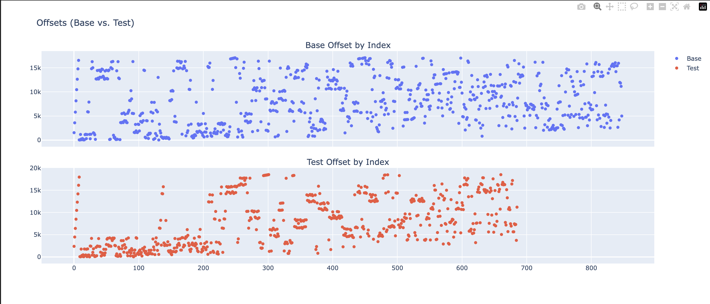

# Android Fault Visualizer

A collection of scripts to analyze Android startup page fault patterns for a given app with support for analyzing
arm and x86 architectures.

## Background

These scripts were created to help evaluate the efficacy of code locality optimizations (e.g. R8 Startup Profile and LLVM's Order Files). For large apps, code loading can be a significant performance bottleneck, particulary on devices with cheap flash memory (eMMC) or low available RAM (~2GB devices). Optimizing code locality can have very material impact (>10%) on startup performance while also reducing the overall code memory footprint.

These scripts are inspired by the page fault animation from the [Droidcon SF 2017 Redex presentation](https://www.youtube.com/watch?v=vtxJvJj6gSE).

Check out the [example](./docs/example.md) to see how these scripts can be used to analyze an app's DEX code locality improvements and [How it Works](./docs/how-it-works.md) to learn how page faults are collected and processed.

## Prerequisites

- Python 3.13
- [uv](https://github.com/astral-sh/uv)
- ⚠️ Devices on Android 12 or newer aggressively preload DEX code with `madvise(WILLNEED)`, which hides true major page faults. For accurate visualizations stick to Android 11 or earlier hardware or emulator images.

## Getting Started

### Setup

1. Download perfetto scripts:

```bash
# Install scripts to record traces
curl -O https://raw.githubusercontent.com/google/perfetto/master/tools/record_android_trace
chmod u+x record_android_trace

# Install scripts to run SQL queries against traces
curl -LO https://get.perfetto.dev/trace_processor
chmod +x ./trace_processor
```

2. Setup Python environment with `uv`:

```bash
uv sync
uv venv
source .venv/bin/activate
```

## Usage

```bash
$ uv run faults.py
usage: faults.py [-h] --package PACKAGE [--output OUTPUT] [--pull-apks] [--skip-collect]

Collect and process Android page faults

options:
  -h, --help         show this help message and exit
  --package PACKAGE  Android package name to analyze
  --output OUTPUT    Output directory (default: output)
  --pull-apks        Pull APKs to get details on which file a page fault in APK corresponds to (default: false)
  --skip-collect     Skip data collection and process previously collected data (default: false)

```

## Collect and process a startup trace

```bash
# Collect a startup trace and process the page faults.
# When prompted, open up the app to profile and wait for startup to complete, then press Ctrl-C.
uv run ./faults.py --package <package_name>
```

### Visualizing

**Step 1. Open the `visualizations.ipynb` notebook.**
**Step 2. Run the cells in order.**

If a custom output directory was used update the second cell:

```python
# Replace with custom output directory if necessary
mapped_faults, file_sizes = load_mappings("output")
```

**Step 3. Select file to analyze**

To analyze page faults for a native library, select the relevant `.so` file. For DEX analysis, it will _typically_ be
the `base.vdex` file (VDEX is roughly concatenation of all DEX files) _OR_ the `base.apk` itself.

**Note:** The location of where DEX code is loaded from is dependent on ahead-of-time compilation state and whether the APK ships with uncompressed DEX files or not.


It is recommended to include minor page faults (i.e page faults that did not require disk access) as this will give a more complete
picture of the efficacy of code locality. In an ideal case, there is a linear scan of pages with a mixture of major and minor page faults (due to disk readahead).


**Caveat:** Whether a page fault is major or minor is determined using heuristics. Check out [docs](./docs/how-it-works.md) for more details.

### Diffing

Results can be diffed by using the `compare.ipynb` notebook.



## Development

### Code formatting

This project uses black for code style enforcement. Use `./format.sh` to format the code and clean notebook outputs.

## Future Work

- Add support for variable page sizes (16KB pages instead of 4KB pages)
- Explore methodologies to accurately measure major / minor page faults through disk controller instrumentation.
- Add support for variable disk readahead sizes.

## Contributing

Contributions are welcome! Please feel free to submit a Pull Request.
