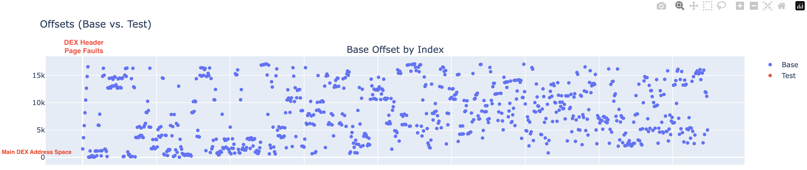
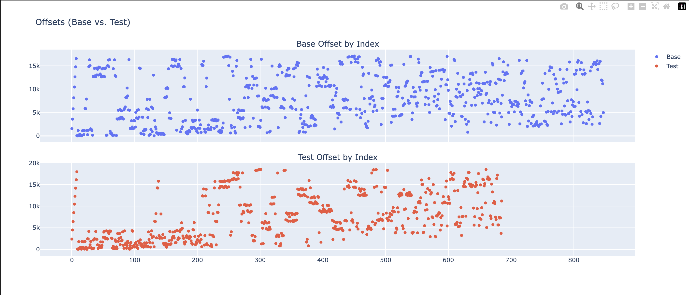
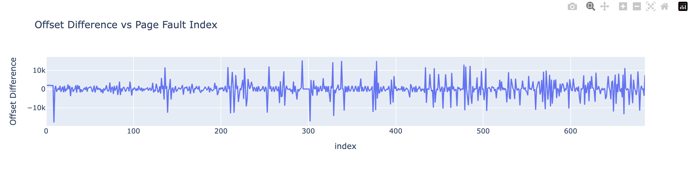
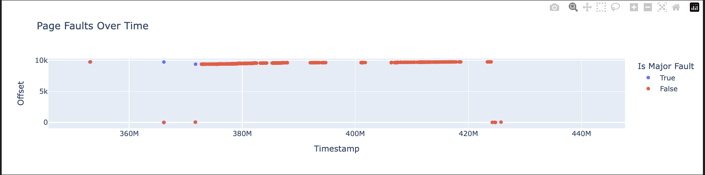
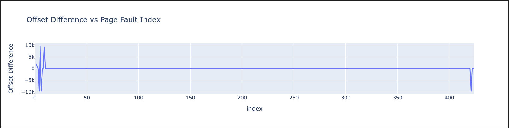
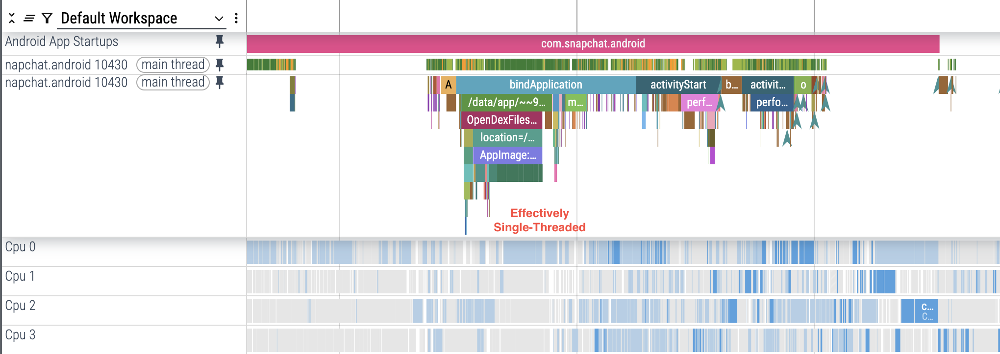

# Analyzing DEX Code Locality Optimizations

The following directory contains data before (`pre-ordering`) and after (`post-ordering`) DEX code locality optimizations through R8's startup profile capabilities.

## Interpreting DEX Page Fault Patterns

Running the `visualizations.ipynb` notebook using the `example/pre-ordering` directory and inspecting the `base.vdex` file, we can observe the DEX page fault pattern.

The `.vdex` file is a concatenation of all the DEX files from the APK. We can see that initially each embedded DEX file's header is read.



We can observe that there are some relatively co-located page faults at the beginning within the main DEX file.
Subsequently, the page faults appear relatively random.

## Evaluating Code Locality Optimizations

Running the `compare.ipynb` notebook using the `example/pre-ordering` and `example/post-ordering` directories, we can observe the impact on page fault patterns through
better code locality.

We can see from the notebook outputs that startup page faults are down by 68 (~15%).

```bash
Elapsed Time: 1975070342, 848 Page Faults , 393 Major Page Faults
Test:
Elapsed Time: 740057113, 686 Page Faults , 325 Major Page Faults
```

**Note:** Disregard the elapsed time as it can be variable due to external factors.

Visually inspecting the page fault patterns clearly demonstrates that the optimized binary has page faults that are colocated in the main DEX as expected.



## Further improving locality

While the number of major page faults have been reduced through R8's startup profile, there is still room for improvement on code locality.

This is apparent when looking at the Offset Difference graph. This graph plots the difference in the current page's offset versus the prior page's offset.

For the DEX code, there are large differences in the offsets and not a linear scan (i.e. page offset incrementing by 1 each time).



We can see what optimal code locality looks like by inspecting the `libclient.so` file in `example/post-ordering`.

In this example, we can see the pages are linearly scanned with most page faults being "minor", indicating that we are able to take advantage of disk readahead.




**Side Note:** In the "Page Faults Over Time" graph, there are more Major Page Faults than just the two. The major page faults just happen to be hidden beneat

**How can we improve locality further?**

To understand how locality can be improved further, we need to understand the limitations of R8's startup profiles.

R8's startup profiles simply does the following:

1. Split methods into "startup" and "non-startup" methods.
2. Ensure class merging and method inlining are not performed across the "startup" / "non-startup" boundary.
3. Insert the startup methods based on the ordering in the startup profile

Importantly, the startup profile order is not taken into account when performing class merging and method inlining within the "startup" boundary.

As a result, large methods needed later in the startup path may end up being loaded in much sooner than needed, and in the worst-case loaded before the app has started paralleliing work across threads (i.e. during the `bindApplication` phase of startup).


