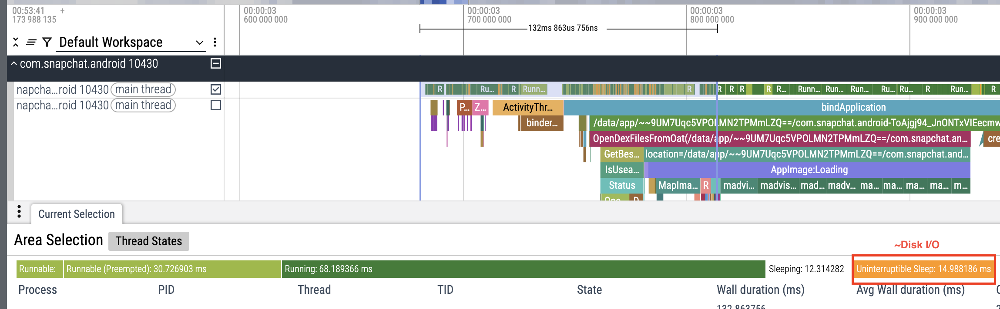

# How it Works

## Collecting a trace

To analyze page faults, we first need a Perfetto trace that captures the relevant page fault events.
In the `ftrace.config`, we want to capture the [page_fault_user](https://github.com/torvalds/linux/blob/v6.15/arch/x86/mm/fault.c#L1462C3-L1462C24) and [mm_filemap_add_to_page_cache](https://github.com/torvalds/linux/blob/v6.15/mm/filemap.c#L948) trace points and Android startup events:

```
data_sources: {
    config {
        name: "linux.ftrace"
        ftrace_config {
            // Page fault tracepoints
            ftrace_events: "exceptions/page_fault_user"
            ftrace_events: "filemap/mm_filemap_add_to_page_cache"
            // Android startup events
            atrace_apps: "*"
            // ...
        }
    }
}
```

To ensure representative disk I/O is captured, the app is force-stopped (`am force-stop`) and the page cache is flushed (`setprop sys.drop_caches 3`) before the recording begins. Disk I/O occurring can be sanity checked by inspecting thread states. Throughout the threads of the app should be orange sections which corresponds to "Uninterruptible Sleep", which is approximately equivalent to disk I/O.



## Processing Page Faults

Processing page faults is architecture-specific as different page fault tracepoints are available.

### x86 / Emulators

On x86, the `page_fault_user` ftrace event is used. This event includes the `address` as one of it's arguments.

```c
DEFINE_EVENT(exceptions, page_fault_user,
	TP_PROTO(unsigned long address,	struct pt_regs *regs, unsigned long error_code),
	TP_ARGS(address, regs, error_code));
```

This can be extracted using the following Perfetto SQL query:

```sql
INCLUDE PERFETTO MODULE android.startup.startups;

SELECT
ftrace_event.ts,
process.name as process_name,
thread.name as thread_name,
EXTRACT_ARG(ftrace_event.arg_set_id, "address")  as address,
EXTRACT_ARG(ftrace_event.arg_set_id, "ip")  as ip
FROM ftrace_event
    left join thread ON ftrace_event.utid = thread.utid
    left join process ON thread.upid = process.upid
WHERE
ftrace_event.name = 'page_fault_user'
-- Filter to events that are contained within the process' startup
AND ftrace_event.ts >= (SELECT MIN(ts) from android_startups WHERE package = process.name)
AND ftrace_event.ts <= (SELECT MIN(ts_end) from android_startups WHERE package = process.name)
AND process.name = '{process_name}'
ORDER BY ts ASC
```

To determine, what file the page fault corresponds to, `/proc/<pid>/maps` is queried to map the adddress to a specific file. The output of that commands looks like the following:

```bash
address space | perm | offset | dev (storage device) | inode | file path
12c00000-52c00000 rw-p 00000000 00:00 0      [anon:dalvik-main space (region space)]
77593e689000-77593e693000: 77593e689000-77593e693000 r--p 00148000 07:30 14     /apex/com.android.runtime/bin/linker64
```

### ARM / Physical Devices

On ARM devices, the script uses the `mm_filemap_add_to_page_cache` ftrace event.

```c
TP_PROTO(struct folio *folio),

TP_ARGS(folio),

TP_STRUCT__entry(
    __field(unsigned long, pfn)
    __field(unsigned long, i_ino)
    __field(unsigned long, index)
    __field(dev_t, s_dev)
    __field(unsigned char, order)
),

DEFINE_EVENT(mm_filemap_op_page_cache, mm_filemap_add_to_page_cache,
	TP_PROTO(struct folio *folio),
	TP_ARGS(folio)
	);
```

This can be extracted using the following Perfetto SQL query:

```sql
INCLUDE PERFETTO MODULE android.startup.startups;

SELECT
ftrace_event.ts,
process.name as process_name,
thread.name as thread_name,
EXTRACT_ARG(ftrace_event.arg_set_id, "s_dev")  as sdev,
EXTRACT_ARG(ftrace_event.arg_set_id, "i_ino")  as inode,
EXTRACT_ARG(ftrace_event.arg_set_id, "index")  as offset
FROM ftrace_event
    left join thread ON ftrace_event.utid = thread.utid
    left join process ON thread.upid = process.upid
WHERE
ftrace_event.name = 'mm_filemap_add_to_page_cache'
-- Filter to events that are contained within the process' startup
AND ftrace_event.ts >= (SELECT MIN(ts) from android_startups WHERE package = process.name)
AND ftrace_event.ts <= (SELECT MIN(ts_end) from android_startups WHERE package = process.name)
AND process.name = '{process_name}'
ORDER BY ts ASC
```

Unlike x86, we do not have the raw address of the page fault and therefore cannot directly map page faults to a file using `/proc/<pid>/maps`. Instead, we need to dump the inodes to find perform the mapping.

Dumping inodes can be performed using the following command:

```bash
adb shell su -c 'find /apex /system /data /vendor -print0 | xargs -0 stat -c "%d %i %n"' > inodes.txt
```

The output of that command looks like the following:

```
# dev inode filename
22 1 /apex
22 88 /apex/.default-apex-info-list.xml
65040 2 /apex/com.android.adbd
65040 11 /apex/com.android.adbd/lost+found
65040 12 /apex/com.android.adbd/bin
65040 13 /apex/com.android.adbd/bin/adbd
65040 16 /apex/com.android.adbd/lib64
65040 24 /apex/com.android.adbd/lib64/libcrypto_utils.so
65040 17 /apex/com.android.adbd/lib64/libadb_pairing_auth.so
65040 23 /apex/com.android.adbd/lib64/libcrypto.so
65040 19 /apex/com.android.adbd/lib64/libadb_pairing_server.so
65040 21 /apex/com.android.adbd/lib64/libbase.so
65040 25 /apex/com.android.adbd/lib64/libcutils.so
```

Using this mapping, the page fault events can be mapped to specific files based on the inode argument (`i_ino`).

## Identifying Major / Minor Page Faults

In both x86 and arm scenarios, we do not get any signal on whether the page fault required accessing the disk. To effectively know if disk I/O was truly performed would require instrumenting down to disk controller.

As an approximation, we assume that the disk readahead for the profiled device is 128KB. Next, the page faults are processed in-order and we keep track of whether the page accessed would be covered by disk readahead of a previous page fault.

## Identifying page faults within APKs

When inspecting page faults for the APK itself, it's important to know which file is being accessed. This is achieved by pulling the APK from the device and extracting the size and file offset of each zip entry. Effectively, creating a mapping similar to `/proc/<pid>/maps`, but for an APK instead of a process.

## Other Notes

**Determining the location of a method in DEX files**

At runtime, a trace is emitted by the Android Runtime for class initializers (`<clinit>`). Using JADX-GUI, the APK can be disassmebled and the output will specify which DEX file the class is located in (e.g. `classes2.dex`). This can be useful for determining a class is being missed by the startup profile; either the startup profile is incomplete or there is a bug with R8

**Debugging source of page faults**

`simpleperf` can be used for collecting stacktraces when a page fault occurs. Using Firefox Profiler's stack chart view, the sources of page faults can be easily visualized.

Below are roughly the commands to use to get the stacktraces (untested):

```bash
# (Not tested) Perform stacktrace sampling and collect a stacktrace when page fault ocurs
./app_profiler.py -p <package_name> -r "-e page-faults -e task-clock:u -f 1000 -g"
# Alternatively, collect stacktrace when thread goes off-cpu, which should equally collect stacktraces when the thread goes into kernel space to perform major page fault.
./app_profiler.py -p <package_name> -r "-e task-clock:u -f 1000 -g --trace-offcpu"
```

**Note:** a `userdebug` build is not strictly required. It is only needed to symbolicate kernel frames, but even without symbolication, it's easy to determine which kernel frames correspond to page faults.
