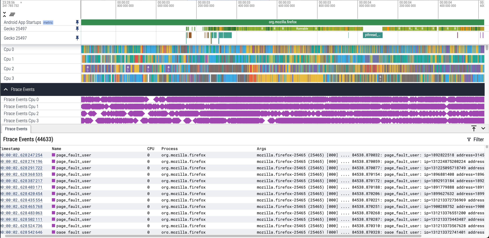
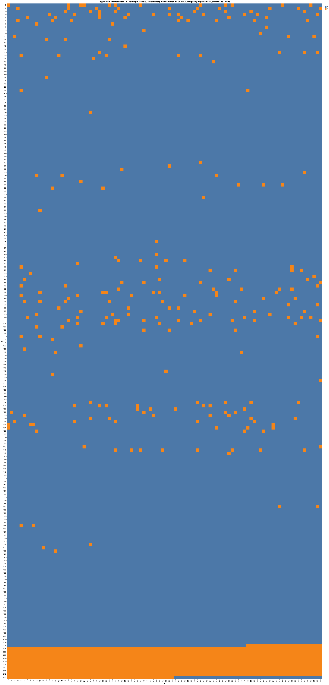
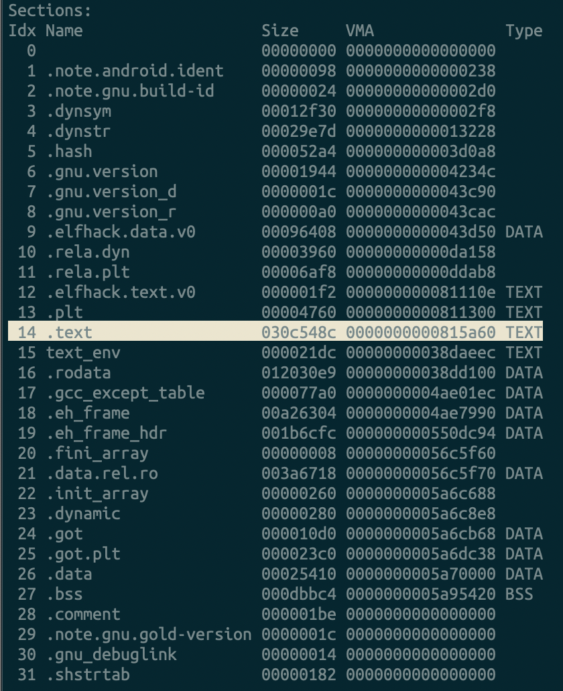
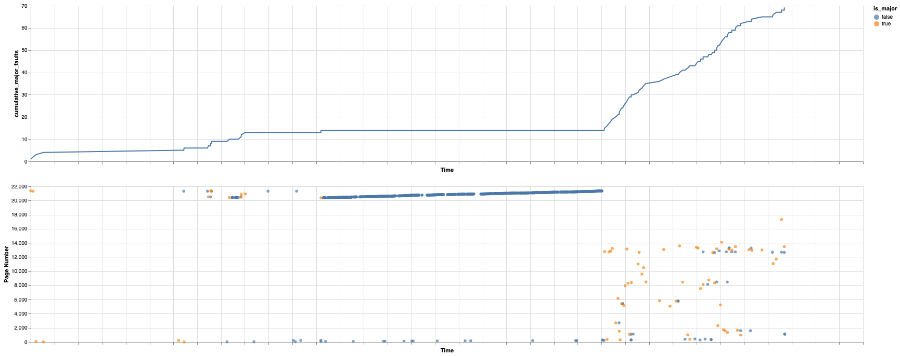

# Example

The following directory contains all the artifacts needed to visualize page faults for Firefox app startup.

Below are screenshots demonstrating how to validate that `libxul.so` is compiled such that code is read from disk sequentially.

The following directory contains example page faults from Firefox startup.

### Perfetto Trace

The following screenshot shows the Firefox app startup and the related page faults triggered. Many of these page faults come from the `Gecko` thread which is responsible for opening `libxul.so`.



### Page Fault Graph

Below, we can see the page fault behavior for `libuxl.so` during the app startup. On completion of startup, a large contiguous chunk of the `.so` file is loaded (orange squares).



### Interpreting loaded pages

Using `objdump`, we can inspect the `.so` file, which uses the ELF file format, to understand what section is being read in by these page faults.

```bash
adb pull /data/app/~~eX4oIyiPqWD2a8bQOTNkaw==/org.mozilla.firefox-V6SAAfPOOi2mgt7uXjLlBg==/lib/x86_64/libxul.so libuxl.so
# Note: Path will differ depending on host's arch
$ANDROID_NDK_HOME/toolchains/llvm/prebuilt/darwin-x86_64/bin/llvm-objdump --all-headers libuxl.so
```

We can observe that the `.text` section, which corresponds to code is being loaded.



### Page Fault Time Series

Below, we graph the page fault offsets in order. We can observe that not only are the pages faulted contiguous but are loaded relatively sequentially.

Note, the page fault access pattern begins to look random near the end of the app startup.

This sequential access pattern will benefit from any disk readaheads performed by the kernel.


